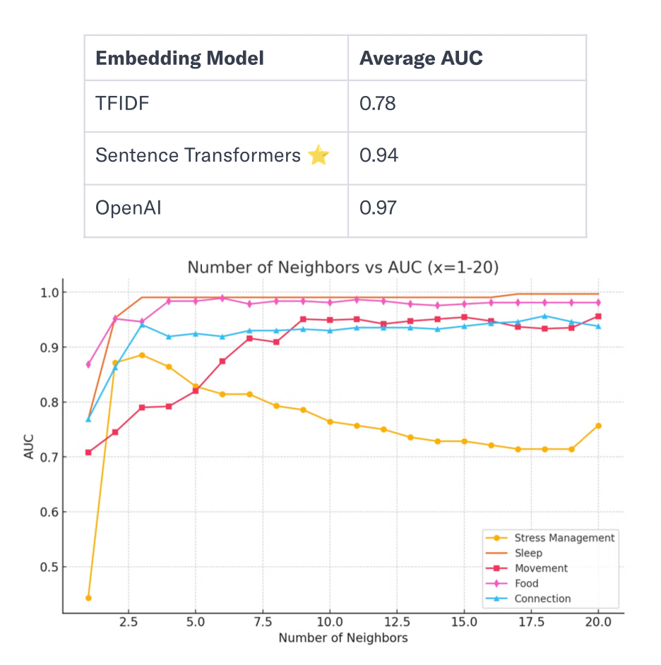

# Thrive AI Intention Classifier

## Project Overview

This is a production-deployed AI-driven "Intention Classifier" I made for Thrive Global to accurately match user intentions (a user's focus area(s) for improving their well-being) with Thrive's personalized journey areas (Connection, Stress Management, Food, Movement, Sleep), enhancing user experience through targeted recommendations.

## Project Structure

1. **Survey Analysis**: Analyzed ~150 user responses, mapping each response to the appropriate journey area(s).
   
   
3. **Intention Embeddings**: Turned each intention intro embeddings; when mapped, neighboring intentions in a cluster should have the same journey.
   
   
5. **Model Building**: Used a K-Nearest Neighbors Classifier to classify journey by using most common journey for nearby intentions. Experimented with different embedding models (TFIDF, Sentence Transformers, OpenAI) and values of k to improve model accuracy.
   
   
   
7. **Model Deployment**: Selected Sentence Transformers for deployment due to its performance (0.94 AUC) and open-source nature.

   

## Project Release

The feature launched in September 2024. It ensures each user receives a personalized Microstep plan to help them achieve their behavior change goals.
